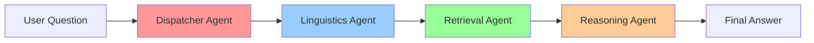

# Multi-Agent Kinh Dịch Chatbot ✨

> **Trạng thái**: ✅ **HOÀN THÀNH** - Dự án AI chatbot Kinh Dịch thông minh với kiến trúc Multi-Agent và giao diện web hiện đại.

Hệ thống AI chatbot thông minh để tra cứu, tư vấn và gieo quẻ Kinh Dịch (I Ching) bằng công nghệ Multi-Agent Architecture. Dự án sử dụng RAG (Retrieval-Augmented Generation), Vector Search và AI reasoning để cung cấp trải nghiệm tư vấn Kinh Dịch toàn diện.

---

## 🌟 Tính Năng Chính

### 🎯 **Dual Mode System**
- **🎲 Gieo Quẻ và Luận Giải**: Gieo quẻ ngẫu nhiên + phân tích cá nhân hóa
- **💬 Hỏi Nhanh**: Tra cứu kiến thức nhanh từ cơ sở tri thức

### 🤖 **Multi-Agent Architecture**
```
🔍 Dispatcher → 🗣️ Linguistics → 📚 Retrieval → 🧠 Reasoning
```
- **Dispatcher Agent**: Phân loại và định tuyến câu hỏi
- **Linguistics Agent**: Xử lý ngôn ngữ và ngữ cảnh
- **Retrieval Agent**: Tìm kiếm thông tin từ vector database
- **Reasoning Agent**: Tổng hợp và đưa ra lời khuyên

### 🎨 **Giao Diện Web Hiện Đại**
- **Gradio Interface**: Giao diện web thân thiện với người dùng
- **Real-time Progress**: Theo dõi tiến trình xử lý Multi-Agent
- **Confidence Scoring**: Đánh giá độ tin cậy của câu trả lời
- **Agent Monitoring**: Giám sát hiệu suất từng agent

### ⚡ **Công Nghệ Tiên Tiến**
- **Vector Search**: FAISS + Sentence Transformers
- **Hexagram Casting**: 4 phương thức gieo quẻ khác nhau
- **Context-Aware**: Kết hợp quẻ và tình huống cá nhân
- **Docker Ready**: Triển khai dễ dàng với Docker

---

## 🚀 Hướng Dẫn Sử Dụng

### 📋 Yêu Cầu Hệ Thống
- **Python**: 3.10+
- **RAM**: Tối thiểu 4GB (khuyến nghị 8GB+)
- **Storage**: ~2GB cho models và data
- **Network**: Kết nối internet cho LLM API

### 🛠️ Cài Đặt

#### Option 1: Docker (Khuyến nghị)
```bash
# 1. Clone repository
git clone https://github.com/VuThanhLam124/KinhDich.git
cd KinhDich

# 2. Build và chạy với Docker
docker-compose up --build
```

#### Option 2: Manual Setup
```bash
# 1. Clone repository
git clone https://github.com/VuThanhLam124/KinhDich.git
cd KinhDich

# 2. Tạo virtual environment
python -m venv venv
source venv/bin/activate  # Linux/Mac
# hoặc
venv\Scripts\activate     # Windows

# 3. Cài đặt dependencies
pip install -r requirements.txt

# 4. Chạy ứng dụng
python Source/app.py
```

### 🌐 Truy Cập Ứng Dụng
Mở trình duyệt và truy cập: **http://localhost:7860**

---

## 📖 Hướng Dẫn Sử Dụng Chi Tiết

### 🎲 Mode: Gieo Quẻ và Luận Giải
**Dành cho**: Tư vấn cá nhân, định hướng cuộc sống

1. **Nhập câu hỏi**: Mô tả tình huống hoặc vấn đề của bạn
2. **Chọn cách gieo**: 
   - 🪙 Ba Đồng Xu (truyền thống)
   - ⚡ Nhanh (tự động)
   - 🎯 Hoàn Toàn Ngẫu Nhiên
   - 🧘 Thiền Định
3. **Nhận kết quả**: Quẻ + Luận giải cá nhân hóa

**Ví dụ câu hỏi**:
- "Tôi đang cân nhắc chuyển việc, xin cho tôi một lời khuyên"
- "Mối quan hệ của tôi và người ấy sẽ đi về đâu?"
- "Công việc kinh doanh sắp tới có thuận lợi không?"

### 💬 Mode: Hỏi Nhanh
**Dành cho**: Học hỏi kiến thức Kinh Dịch

- Tra cứu ý nghĩa quẻ, triết lý âm dương
- Hiểu về 64 quẻ và cấu trúc Kinh Dịch
- Tìm hiểu các khái niệm và thuật ngữ

**Ví dụ câu hỏi**:
- "Quẻ Cách có ý nghĩa gì trong Kinh Dịch?"
- "Triết lý âm dương được hiểu như thế nào?"
- "64 quẻ Kinh Dịch được chia thành mấy nhóm?"

---

## 🏗️ Kiến Trúc Hệ Thống

### 📁 Cấu Trúc Dự Án
```
KinhDich/
├── 🚀 Source/                     # Mã nguồn chính
│   ├── app.py                    # ⭐ Gradio Web Application
│   ├── orchestrator.py           # 🎯 Multi-Agent Orchestrator
│   ├── dispatcher_agent.py       # 🔍 Routing & Classification
│   ├── linguistics_agent.py      # 🗣️ Language Processing
│   ├── retrieval_agent.py        # 📚 Vector Search
│   ├── reasoning_agent.py        # 🧠 Final Reasoning
│   ├── hexagram_caster.py        # 🎲 Hexagram Casting
│   ├── base_agent.py             # 🤖 Base Agent Class
│   └── config.py                 # ⚙️ Configuration
├── 📚 Kinh_Dich_Data/            # Dữ liệu Kinh Dịch
│   ├── CHU_DICH_HA_KINH/         # 64 quẻ Hạ Kinh
│   ├── CHU_DICH_THUONG_KINH/     # 64 quẻ Thượng Kinh  
│   ├── DICH_THUYET_CUONG_LINH/   # Dịch Thuyết Cương Lĩnh
│   ├── DO_THUYET_CUA_CHU_HY/     # Đồ Thuyết của Chu Hy
│   ├── NHUNG_DIEU_NEN_BIET/      # Những Điều Nên Biết
│   └── TUA_CUA_TRINH_DI/         # Tựa của Trình Dĩ
├── 🗂️ faiss_index/               # FAISS Vector Database
├── 🔧 require_json/              # JSON Configuration Files
├── 🐳 docker-compose.yml         # Docker Configuration
└── 📋 requirements.txt           # Python Dependencies
```

### 🔄 Multi-Agent Workflow


### 🧠 Core Components

#### 🎲 Hexagram Casting System
```python
# 4 phương thức gieo quẻ
- coins: Ba đồng xu truyền thống
- quick: Tự động nhanh
- random: Hoàn toàn ngẫu nhiên  
- meditation: Thiền định
```

#### 📊 Vector Search Engine
```python
# FAISS + Sentence Transformers
- Model: all-MiniLM-L6-v2
- Dimensions: 384
- Search: Semantic similarity
- Reranking: Context-aware
```

---

## 🔧 Cấu Hình Nâng Cao

### 🌐 Environment Variables
```bash
# Source/config.py
GEMINI_API_KEY="your_gemini_api_key"
VECTOR_MODEL="sentence-transformers/all-MiniLM-L6-v2"
FAISS_INDEX_PATH="faiss_index/"
MAX_RETRIEVAL_DOCS=10
CONFIDENCE_THRESHOLD=0.7
```

### 🤖 Agent Configuration
```python
# Tùy chỉnh prompt và behavior cho từng agent
DISPATCHER_PROMPT = "..."
LINGUISTICS_PROMPT = "..."
RETRIEVAL_PROMPT = "..."
REASONING_PROMPT = "..."
```

---

## 🧪 Testing & Debugging

### 🔍 Debug Mode
```bash
# Bật debug mode để xem agent workflow
python Source/debug_vector_search.py
```

### 📊 Performance Monitoring
- **Agent Stats**: Thời gian xử lý từng agent
- **Confidence Score**: Độ tin cậy câu trả lời
- **Reasoning Chain**: Chuỗi suy luận chi tiết

---

## 🚧 Roadmap cho Người Kế Tiếp

### 🔥 Cải Tiến Ưu Tiên Cao
1. **🌍 Đa ngôn ngữ**: Thêm hỗ trợ tiếng Anh, tiếng Trung
2. **👤 User Authentication**: Hệ thống đăng nhập và lưu lịch sử
3. **📊 Analytics Dashboard**: Thống kê sử dụng và feedback
4. **🎯 Fine-tuning**: Train model specific cho Kinh Dịch
5. **📱 Mobile App**: Phát triển ứng dụng di động

### 🎨 Cải Tiến UI/UX
1. **🎨 Theme System**: Dark/Light mode, custom themes
2. **🔊 Voice Input/Output**: Tích hợp speech-to-text
3. **📊 Visualization**: Biểu đồ quẻ và trigrام interactive
4. **💾 Export Features**: Xuất kết quả PDF/Word
5. **🔄 Real-time Collaboration**: Chia sẻ session

### ⚡ Cải Tiến Kỹ Thuật
1. **🚀 Performance Optimization**:
   ```python
   # Async processing cho multiple agents
   # Caching cho frequent queries  
   # Model quantization để giảm memory
   ```

2. **🔍 Advanced Search**:
   ```python
   # Hybrid search (semantic + keyword)
   # Multi-modal search (text + images)
   # Context-aware reranking
   ```

3. **🤖 Enhanced AI**:
   ```python
   # Agent specialization (fortune, health, career)
   # Dynamic prompt generation
   # Few-shot learning examples
   ```

### 📚 Data Enhancement
1. **📖 Mở rộng dữ liệu**: Thêm các tài liệu Kinh Dịch khác
2. **🏷️ Data Annotation**: Gán nhãn semantic cho chunks
3. **🔗 Knowledge Graph**: Xây dựng graph relationships
4. **📊 Quality Control**: Validation và cleanup data

### 🔧 DevOps & Scaling
1. **☁️ Cloud Deployment**: AWS/GCP/Azure deployment
2. **📊 Monitoring**: Prometheus + Grafana
3. **🔄 CI/CD**: Automated testing và deployment
4. **📈 Auto-scaling**: Load balancing cho high traffic

---

## 🛠️ Hướng Dẫn Phát Triển

### 🎯 Thêm Agent Mới
```python
# 1. Tạo file mới: Source/new_agent.py
from base_agent import BaseAgent

class NewAgent(BaseAgent):
    def __init__(self):
        super().__init__("new_agent")
    
    async def process(self, query, context):
        # Implementation logic
        return result

# 2. Thêm vào orchestrator.py
from new_agent import NewAgent
```

### 📊 Thêm Tính Năng Monitoring
```python
# Source/monitoring.py
import time
import logging

class AgentMonitor:
    def track_performance(self, agent_name, start_time):
        # Track agent performance
        pass
    
    def log_user_interaction(self, query, response):
        # Log interactions cho analytics
        pass
```

### 🔍 Custom Retrieval Strategy
```python
# Source/custom_retrieval.py
class CustomRetriever:
    def hybrid_search(self, query):
        # Combine semantic + keyword search
        semantic_results = self.semantic_search(query)
        keyword_results = self.keyword_search(query)
        return self.merge_results(semantic_results, keyword_results)
```

---

## 📞 Hỗ Trợ & Đóng Góp

### 🤝 Contributing Guidelines
1. **Fork** repository
2. **Tạo branch** cho feature mới: `git checkout -b feature/amazing-feature`
3. **Commit** changes: `git commit -m 'Add amazing feature'`
4. **Push** to branch: `git push origin feature/amazing-feature`
5. **Tạo Pull Request** với mô tả chi tiết

### 🐛 Bug Reports
- Sử dụng GitHub Issues
- Cung cấp logs và steps to reproduce
- Tag với appropriate labels

### 💡 Feature Requests
- Mô tả use case chi tiết
- Đánh giá priority và impact
- Thảo luận technical approach

---

## 📚 Tài Liệu Tham Khảo

### 🔗 Technical Resources
- [Gradio Documentation](https://gradio.app/docs/)
- [FAISS Documentation](https://faiss.ai/)
- [Sentence Transformers](https://www.sbert.net/)
- [LangChain Documentation](https://docs.langchain.com/)

### 📖 Domain Knowledge
- [I Ching (Wikipedia)](https://en.wikipedia.org/wiki/I_Ching)
- [64 Hexagrams](https://en.wikipedia.org/wiki/List_of_hexagrams_of_the_I_Ching)
- [Traditional Chinese Medicine](https://en.wikipedia.org/wiki/Traditional_Chinese_medicine)

---

## 📄 Giấy Phép & Liên Hệ

### 📜 License
Dự án này được phân phối dưới **MIT License**. Xem file `LICENSE` để biết chi tiết.

### 👤 Liên Hệ
- **Author**: Vũ Thành Lâm
- **Email**: [vuthanhlam848@gmail.com](mailto:vuthanhlam848@gmail.com)
- **GitHub**: [@VuThanhLam124](https://github.com/VuThanhLam124)
- **Project**: [KinhDich Repository](https://github.com/VuThanhLam124/KinhDich)

### 🙏 Acknowledgments
- **Kinh Dịch Community** vì cung cấp kiến thức và tài liệu
- **Open Source Community** cho các tools và libraries tuyệt vời
- **Beta Testers** đã giúp improve UX và tìm bugs

---

<div align="center">

### ⭐ Nếu dự án hữu ích, hãy star repository này!

**Được phát triển với ❤️ by Vietnam AI Community**

</div>
